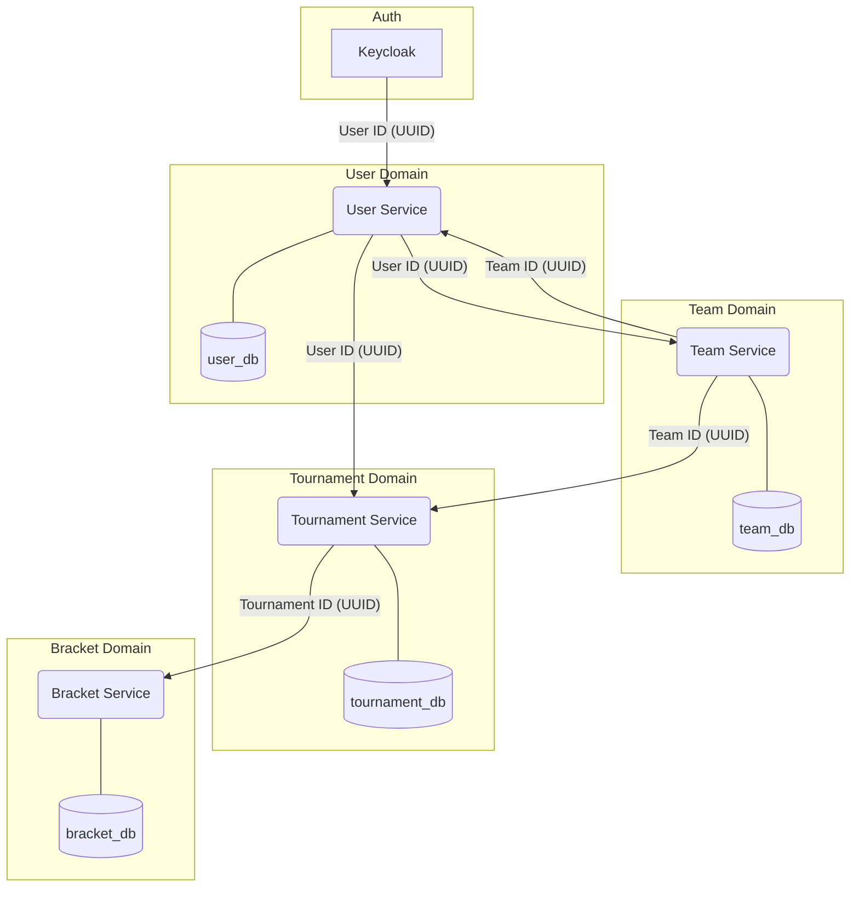

# Architecture & Data Model Overview

This document provides a high-level overview of the t-hub microservices architecture and the data model that underpins it.

## Guiding Principles

Our database design follows several key principles of microservice architecture:

*   **Service-Per-Database:** Each microservice is the single source of truth for its domain and owns its own database. For example, the `team-service` is the only service that can write to the `teams` table.
*   **Loose Coupling:** There are no foreign key constraints between the databases of different services. Instead, services are linked by storing the UUID of a resource from another service. For example, the `tournaments` table stores an `organizer_id`, but does not have a foreign key to the `users` table. This means that if the `user-service` is down, the `tournament-service` can still operate.
*   **Asynchronous Communication (Planned):** While the initial implementation may use synchronous REST calls for some operations, the long-term plan is to use a message broker (like RabbitMQ) for inter-service communication to improve resilience and decoupling.
*   **Data Duplication for Performance:** We strategically duplicate a small amount of data (e.g., caching `username` in the `users` table) to avoid expensive cross-service calls for frequently accessed information.

## Service Relationship Diagram

The following diagram illustrates the relationships and data flow between the different services.

## The Flow

1.  **User Registration:** A new user registers via the frontend. The request goes to the `api-gateway`, which first creates the user in **Keycloak**.
2.  **User Service:** The `api-gateway` then takes the unique `keycloak_id` and sends it to the **User Service** to create a corresponding user record in its local database.
3.  **Team Creation:** A user creates a team. This request goes to the **Team Service**, which stores the new team and the `captain_id` (which is a `user_id` from the User Service).
4.  **Tournament Registration:** The team captain registers their team for a tournament. This request goes to the **Tournament Service**, which stores the `team_id` and `tournament_id`.
5.  **Bracket Generation:** When a tournament starts, the **Bracket Service** reads the registrations from the Tournament Service and generates the initial bracket structure in its own database.

This distributed data model gives us the flexibility and resilience needed for a microservices architecture. For detailed information on the schema for each service, please refer to the `SCHEMA.md` file in the respective service's directory.
