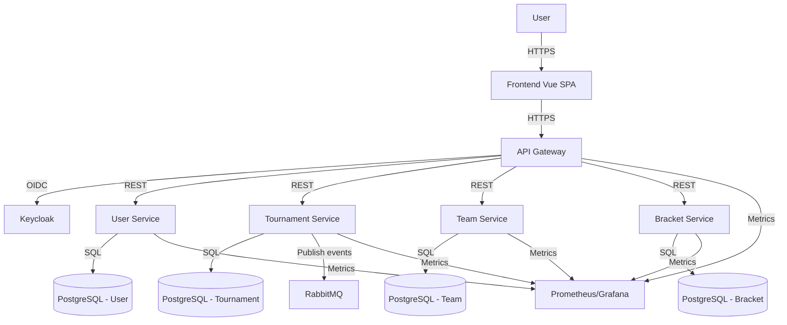

```mermaid
graph TD
  User[User] -->|HTTPS| FE[Frontend Vue SPA]
  FE -->|HTTPS| APIGW[API Gateway]
  APIGW -->|OIDC| KC[Keycloak]

  APIGW -->|REST| US[User Service]
  APIGW -->|REST| TS[Tournament Service]
  APIGW -->|REST| TeamS[Team Service]
  APIGW -->|REST| BS[Bracket Service]

  US -->|SQL| UDB[(PostgreSQL - User)]
  TS -->|SQL| TDB[(PostgreSQL - Tournament)]
  TeamS -->|SQL| TeamDB[(PostgreSQL - Team)]
  BS -->|SQL| BDB[(PostgreSQL - Bracket)]

  TS -->|Publish events| MQ[RabbitMQ]

  US -->|Metrics| Mon[Prometheus/Grafana]
  TS -->|Metrics| Mon
  TeamS -->|Metrics| Mon
  BS -->|Metrics| Mon
  APIGW -->|Metrics| Mon
```
