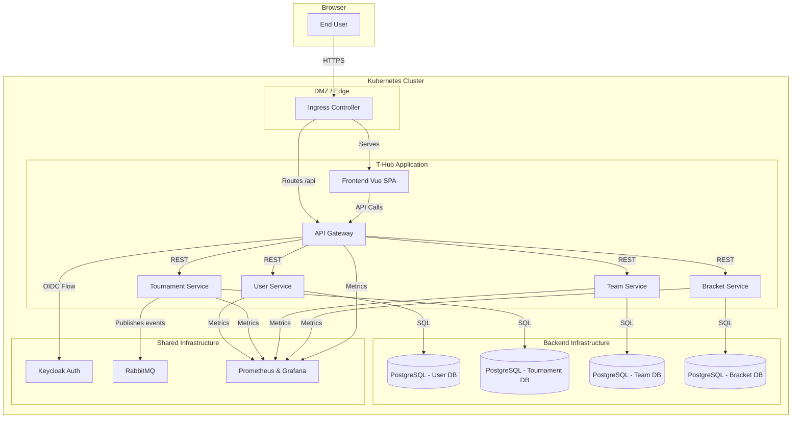

# T-Hub System Architecture

This document provides a detailed overview of the microservices architecture for the T-Hub Tournament Platform.

## Guiding Principles

The architecture is designed around the following core principles:
- **Separation of Concerns:** Each microservice has a single, well-defined responsibility. This makes the system easier to understand, develop, and maintain.
- **Scalability:** Individual services can be scaled independently based on their specific load, allowing for efficient resource utilization.
- **Resilience:** The failure of one non-critical service should not cause a catastrophic failure of the entire system.
- **Technology Autonomy:** Each service can potentially use different technologies, although for consistency, they are currently all written in Go.

## Architecture Diagram

The following diagram illustrates the high-level components of the system and their interactions.

## Core Components

### Frontend (Vue.js)
A modern Single-Page Application (SPA) built with Vue.js that provides the complete user interface for the platform. It communicates with the backend exclusively through the API Gateway.

### API Gateway
The single entry point for all client-side requests. Its responsibilities include:
- **Request Routing:** Proxying incoming requests to the appropriate downstream microservice (e.g., a request to `/api/teams` is routed to the Team Service).
- **Authentication Enforcement:** Intercepting all incoming requests to verify the JWT token provided by the client. It communicates with Keycloak to validate the token before forwarding the request.
- **Centralized Cross-Cutting Concerns:** Serves as a central point for CORS policy, rate limiting, and request logging.

### User Service
It stores information like usernames and emails, which are cached from Keycloak upon user creation. It does **not** handle authentication itself.

### Team Service
Responsible for all team-related logic:
- Creating and managing teams.
- Handling team memberships (users joining/leaving).
- Managing the invitation system for new members.

### Tournament Service
The core service for tournament management. Its responsibilities include:
- Creating, configuring, and updating tournaments.
- Managing the tournament lifecycle through various statuses (e.g., `draft`, `registration_open`, `completed`).
- Handling user and team registrations for tournaments.
- Publishing events to RabbitMQ when key actions occur (e.g., `TournamentCreated`, `TournamentStatusUpdated`).

### Bracket Service
Responsible for the logic of in-tournament play:
- Generating bracket structures (e.g., single-elimination trees) once tournament registration is complete.
- Storing the state of all matches within a bracket.
- Handling the reporting of match scores and advancing winners to the next round.

---

## Cross-Cutting Concerns

### Authentication & Authorization
- **Authentication:** Handled centrally by **Keycloak**. The frontend uses the OIDC `Authorization Code Flow with PKCE` to obtain a JWT token for the user. This token is then sent in the `Authorization` header for all subsequent API requests.
- **Authorization:** The API Gateway validates the token for every request. User identity (`id`, `email`, `roles`) is extracted from the token and passed to downstream services via HTTP headers (e.g., `X-User-Id`). Services can then use this information to make authorization decisions (e.g., "is this user the captain of the team they are trying to delete?").

### Service Communication
- **Synchronous (REST):** The primary mode of communication is synchronous RESTful APIs. For simplicity and immediate feedback to the user, most operations (e.g., creating a team, fetching a tournament) follow a request/response pattern through the API Gateway.
- **Asynchronous (Event-Driven):** **RabbitMQ** is implemented as an architectural backbone for extensibility. The `tournament-service` publishes domain events (e.g., `TournamentCreated`) to an exchange. 
    - *Design Intent:* This Decoupled Architecture allowing future services (e.g., a Notification Service or Analytics Engine) to be added to the cluster and consume these events without requiring code changes in the Tournament Service.

### Observability
The architecture is designed to be "observable by default" using the **RED Method** (Rate, Errors, Duration).
- **Instrumentation:** A custom Go middleware intercepts every HTTP request at the microservice level.
- **Collection:** It records the duration and status code, exposing them via a `/metrics` endpoint in Prometheus format.
- **Visualization:** A Prometheus instance scrapes these targets, and Grafana dashboards visualize the health and performance of the inter-service communication.

### Data Management
The project follows the **Database per Service** pattern. Each microservice is the sole owner of its own database and schema. This ensures loose coupling—changes to one service's database do not directly impact another. There are no cross-database foreign key constraints. Data consistency across services is managed at the application layer or through future event-driven patterns.

### Concurrency & Data Consistency
To handle high-concurrency scenarios (e.g., the "ticket scalper" problem where 50 users try to register for the last tournament slot simultaneously), the architecture implements **Pessimistic Locking** at the database level.

- **Strategy:** The Tournament Service initiates a database transaction and uses `SELECT ... FOR UPDATE` to lock the tournament row.
- **Trade-off:** This prioritizes **Consistency** over Availability/Latency. It forces requests to be processed sequentially for that specific resource, ensuring that the `MaxParticipants` constraint is never violated, even under heavy load.

### Deployment & Infrastructure (GitOps)
The entire application stack is deployed and managed using a GitOps workflow. For a detailed explanation of this process, see [`gitops.md`](./gitops.md).