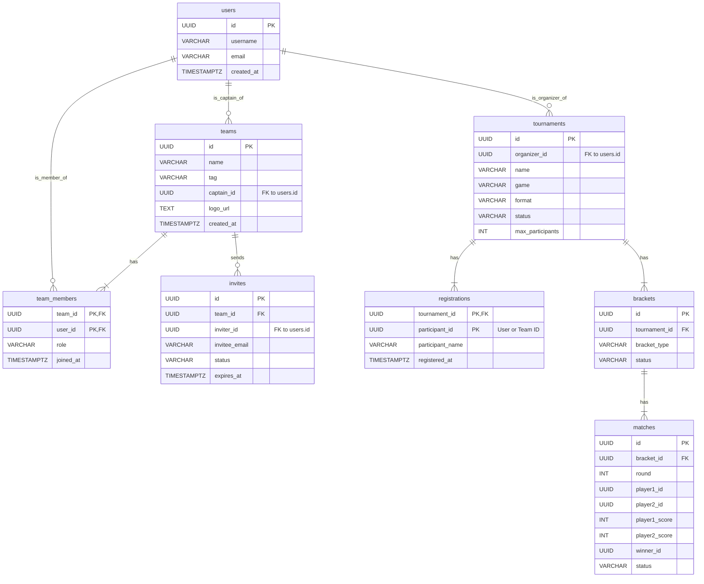

# Database Schema Overview

This document provides a complete overview of the database schemas for all microservices. It includes an Entity-Relationship Diagram (ERD) to visualize the relationships between tables, as well as the full SQL `CREATE TABLE` statements for each service.

## Entity-Relationship Diagram (ERD)

This diagram shows the tables for each service and the relationships between them.

---

## SQL Schemas by Service

### User Service (`user_db`)

For the detailed schema, see [`services/user-service/SCHEMA.md`](../services/user-service/SCHEMA.md).

### Team Service (`team_db`)

For the detailed schema, see [`services/team-service/SCHEMA.md`](../services/team-service/SCHEMA.md).

### Tournament Service (`tournament_db`)

For the detailed schema, see [`services/tournament-service/SCHEMA.md`](../services/tournament-service/SCHEMA.md).

### Bracket Service (`bracket_db`)

For the detailed schema, see [`services/bracket-service/SCHEMA.md`](../services/bracket-service/SCHEMA.md).
