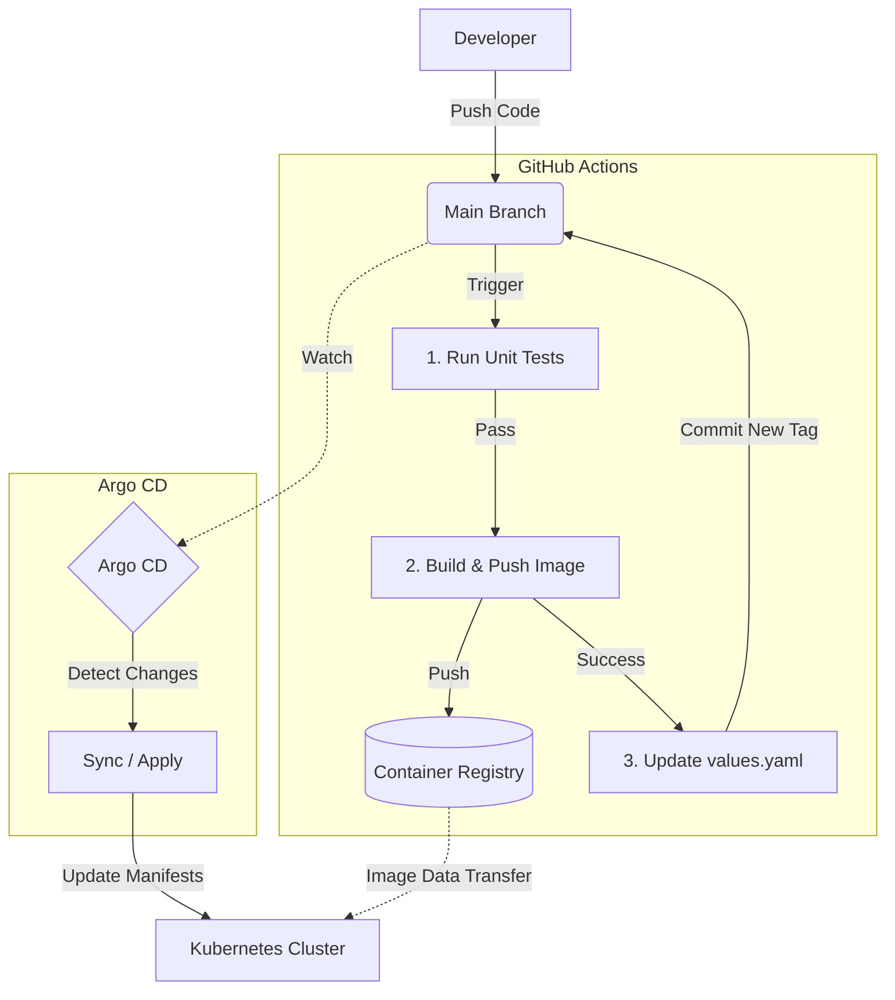

# GitOps Workflow: GitHub Actions & Argo CD

This document describes the GitOps workflow used in the T-Hub project to automate the integration and deployment of services. Git is used as the single source of truth for both application code and infrastructure configuration.

The workflow is split into two phases: Continuous Integration (CI), handled by GitHub Actions, and Continuous Deployment (CD), handled by Argo CD.

---

## CI with GitHub Actions (The "Builder")

The Continuous Integration pipeline is defined in `.github/workflows/ci.yaml`. Its primary responsibility is to take new source code, build it into a Docker image, and update the desired state in the Git repository. It **does not** deploy directly to Kubernetes.

### Trigger

The CI workflow is triggered automatically whenever new code (frontend or services folder) is pushed to the `main` branch.

### The Process

1.  **Run Unit Tests:** Before building, unit tests for the changed Go services are executed. If any tests fail, the pipeline stops, preventing faulty code from being built or pushed.

2.  **Build Docker Image:** The workflow checks which service's code has changed. It then builds a new Docker image for that specific service (e.g., `tournament-service`).

2.  **Tag and Push Image:** Each new image is tagged with the unique Git commit SHA of the changes. This provides excellent traceability. The tagged image is then pushed to the project's container registry (GitHub Container Registry).

3.  **Update Configuration in Git:** This is the crucial GitOps step. The CI workflow automatically checks out the repository, finds the corresponding Helm chart for the service that was just built (e.g., `k8s/charts/tournament-service/`), and updates the `values.yaml` file. It changes the `image.tag` value to the new Git commit SHA.

4.  **Commit Changes:** The workflow commits and pushes the modified `values.yaml` file back to the `main` branch of the repository.

**Outcome of CI:** The source code has been turned into a versioned Docker image, and the desired state of our application in Git has been updated to reference this new image version.

---

## CD with Argo CD

The Continuous Deployment process is managed by Argo CD, which runs inside the Kubernetes cluster. Its only job is to make sure the live state of the cluster matches the desired state defined in the Git repository.

### Trigger

Argo CD continuously monitors the `main` branch of the Git repository. It is not triggered by a "push" in the traditional sense; rather, it detects a deviation between its observed state and the state defined in Git.

### The Process

1.  **Detect "Out of Sync" State:** When the GitHub Actions workflow pushes the updated `values.yaml` file, Argo CD detects that the `image.tag` in Git is now different from the image tag currently running in the cluster. It marks the corresponding Application (defined in `k8s/argo-apps/`) as `OutOfSync`.

2.  **Automated Sync:** Because our Argo CD Applications are configured with an automated `syncPolicy`, Argo CD immediately begins the sync process to reconcile the difference.

3.  **Generate and Apply Manifests:** Argo CD pulls the latest version of the Helm chart from Git. It uses the updated `values.yaml` to generate the final Kubernetes manifests for the service. For example, the `Deployment` manifest will now specify the new Docker image tag.

4.  **Kubernetes Takes Over:** Argo CD applies these new manifests to the cluster. The Kubernetes control plane detects the change to the `Deployment` resource and initiates a **rolling update**. It gracefully terminates the old pods and starts new ones with the new container image.

**Outcome of CD:** The new version of the service is now live in the Kubernetes cluster, and the live state once again matches the desired state in Git. The Argo CD UI will show the Application as `Synced` and `Healthy`.

### Visual Flow

