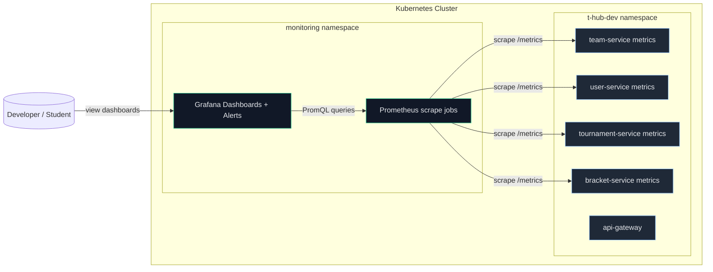
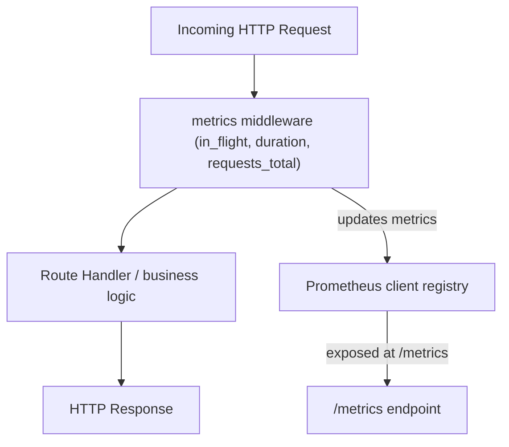

# Monitoring decisions and graphs

## 1. Kubernetes Metrics Scraping & Visualization Flow

## 2. HTTP Request → Metrics Collection Flow

## 3. Prometheus and Grafana
We used prometheus to scrape the services and grafana for some simple graphs and alerts. To access prometheus directly one needs to portforward to the service. But we decided to expose grafana with ingress. We know that this is not best practice but having a stable access point made development easier. The dashboards can be found at k8s/infra-charts/monitoring/dashboards/ and the alerts at k8s/infra-charts/monitoring/templates/prometheus-rules-configmap.yaml

## 4. No logging or tracing tools used
Some basic logging is provided by rancher/argocd and that is the only thing we used when working on this project.
