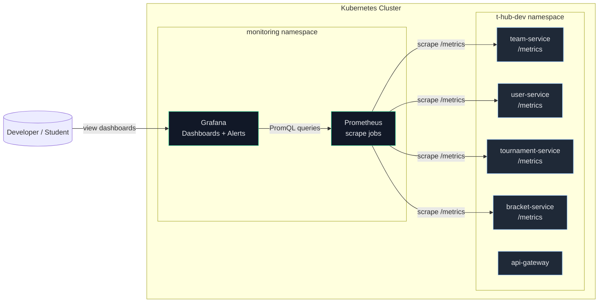
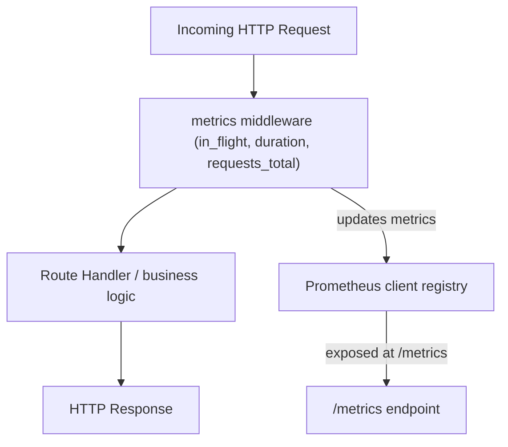

# Observability & Metrics Architecture

## 1. Kubernetes Metrics Scraping & Visualization Flow

```mermaid
flowchart LR
  subgraph K8s[Kubernetes Cluster]
    subgraph NSAPP[t-hub-dev namespace]
      S1[team-service\n/metrics]:::svc
      S2[user-service\n/metrics]:::svc
      S3[tournament-service\n/metrics]:::svc
      S4[bracket-service\n/metrics]:::svc
      GW[api-gateway]:::svc
    end

    subgraph NSMON[monitoring namespace]
      P[Prometheus\nscrape jobs]:::mon
      G[Grafana\nDashboards + Alerts]:::mon
    end
  end

  P -->|scrape /metrics| S1
  P -->|scrape /metrics| S2
  P -->|scrape /metrics| S3
  P -->|scrape /metrics| S4

  G -->|PromQL queries| P
  U[(Developer / Student)] -->|view dashboards| G

  classDef svc fill:#1f2937,stroke:#93c5fd,color:#e5e7eb
  classDef mon fill:#111827,stroke:#34d399,color:#e5e7eb
```

## 2. HTTP Request → Metrics Collection Flow

```mermaid
flowchart TB
  R["Incoming HTTP Request"]
  R --> M["metrics middleware (in_flight, duration, requests_total)"]
  M --> H["Route Handler / business logic"]
  H --> Resp["HTTP Response"]
  M -->|updates metrics| REG["Prometheus client registry"]
  REG -->|exposed at /metrics| METRICS["/metrics endpoint"]
```
